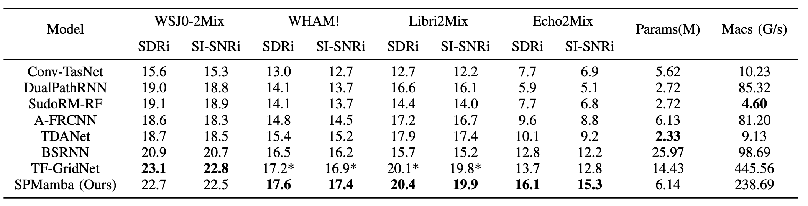

<p align="center">
  
</p>

<p align="center">
  <strong>Kai Li<sup>1</sup>, Guo Chen<sup>1</sup>, Xiaolin Hu<sup>1</sup></strong><br>
    <strong><sup>1</sup>Tsinghua University, China</strong><br>
  <a href="https://arxiv.org/abs/2404.02063">ArXiv</a> | <a href="https://cslikai.cn/SPMamba/">Demo</a>

<p align="center">
  
  
  
</p>

<p align="center">

# SPMamba: State-space model is all you need in speech separation

## Abstract

SPMamba is an innovative speech separation model designed to address the complexity of modeling long audio sequences in existing LSTM and Transformer-based systems. Building on the robust TF-GridNet architecture, SPMamba replaces traditional BLSTM components with bidirectional Mamba modules, which efficiently capture spatiotemporal relationships in both time and frequency dimensions. This allows the model to handle long-range dependencies with linear computational complexity. By leveraging bidirectional processing, SPMamba enhances separation performance by utilizing both past and future context. Extensive experiments on datasets such as **WSJ0-2Mix, WHAM!, Libri2Mix**, and the newly constructed **Echo2Mix** demonstrated that SPMamba not only outperformed state-of-the-art models but also reduced computational complexity.

## 🔥 News

[2024-11-22] Release Checkpoint SPMamba model checkpoints (Libri2Mix and Echo2Mix) are available at [[Checkpoint]](https://github.com/JusperLee/SPMamba/releases/tag/v1.0)

[2024-09-06] Demo Website SPMamba is now available at [[Demo]](https://cslikai.cn/SPMamba/)

[2024-09-06] Release Datasets Echo2Mix, a new dataset for speech separation. [[DataEcho2Mix]](https://drive.google.com/file/d/1nJ9ujAbf4LxXEFzFwEpr9CwJOeNHghw0/view)

[2024-05-09] Update SPMamba **WHAM!** Result: SI-SNRi=17.4 dB, SDRi=17.6 dB

[2024-04-23] Update SPMamba MACs: **238.21 G/s** using [[code]](https://github.com/state-spaces/mamba/issues/110)

[2024-04-18] Update SPMamba **WSJ0-2Mix** Result: SI-SNRi=22.5 dB, SDRi=22.7 dB

## Installation

clone the repository

```bash
git clone https://github.com/JusperLee/SPMamba.git && cd SPMamba
conda env create -f look2hear.yml
conda activate look2hear
```

## Usage

To train the SPMamba model, run the following command:

```bash
python audio_train.py --conf_dir=configs/spmamba.yml
```

## Performance

*Here, you can include a brief overview of the performance metrics or results that SPMamba achieves using WSJ0-2Mix, WHAM!, Libri2Mix, Echo2Mix*



## License

SPMamba is licensed under the Apache License 2.0. For more details, see the [LICENSE](LICENSE) file in the repository.

## Acknowledgements

SPMamba is developed by the **Look2Hear** at Tsinghua University. We would like to thank the **ESPnet team** for their contributions to the open-source community and for providing a solid foundation for our work.

## Citation

If you use SPMamba in your research or project, please cite the following paper:

```
@article{li2024spmamba,
  title={SPMamba: State-space model is all you need in speech separation},
  author={Li, Kai and Chen, Guo and Hu, Xiaolin},
  journal={arXiv preprint arXiv:2404.02063},
  year={2024}
}
```

## Contact

For any questions or feedback regarding SPMamba, feel free to reach out to us via email: `tsinghua.kaili@gmail.com`
